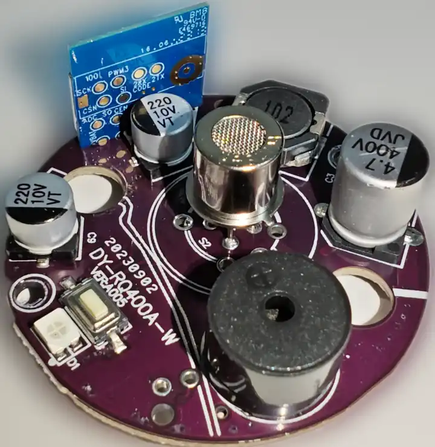
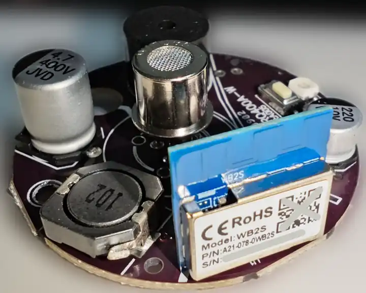
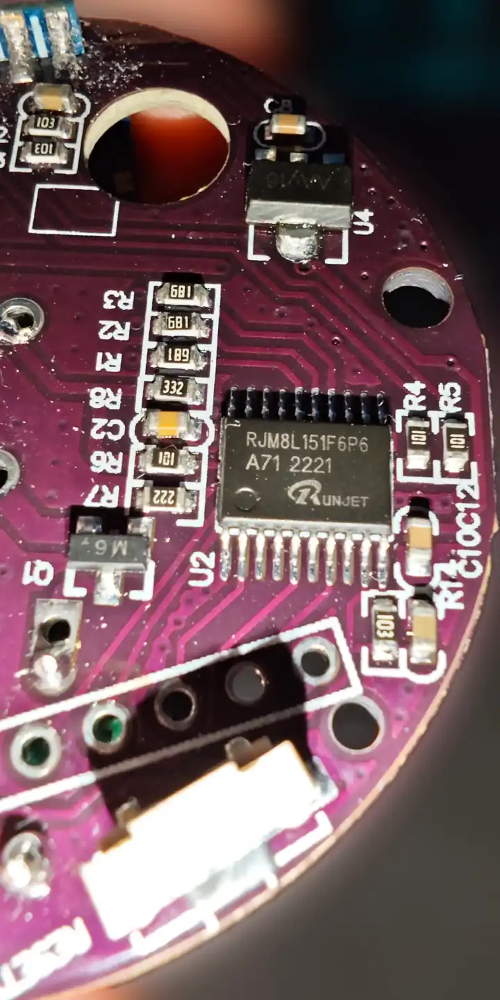
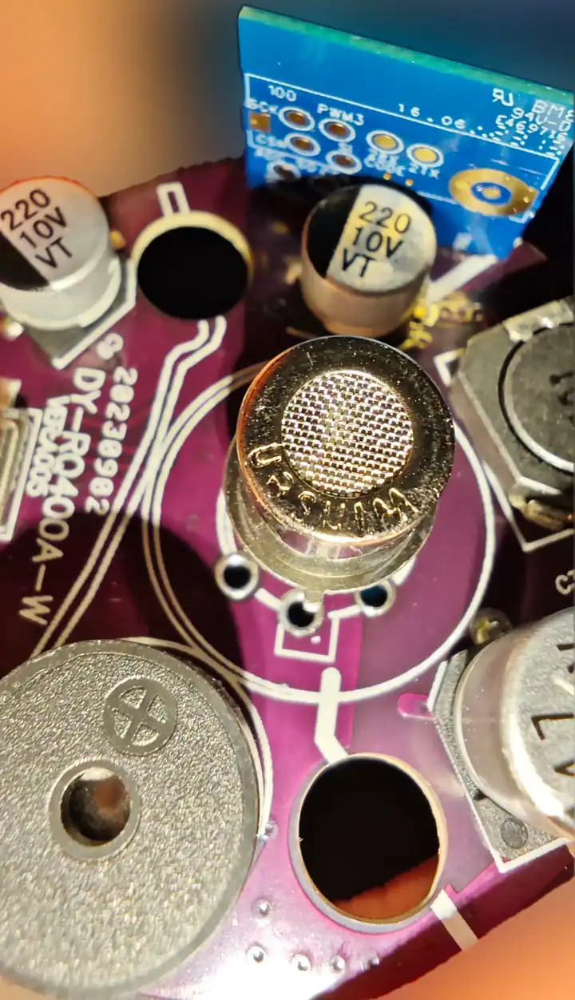
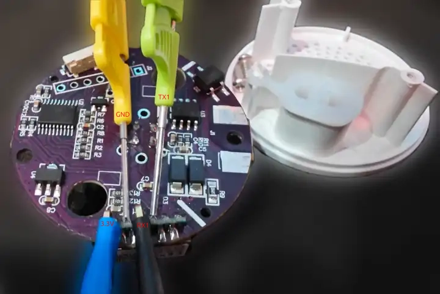
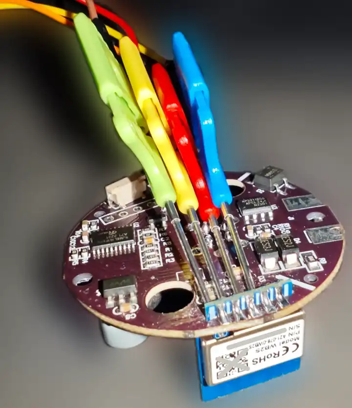
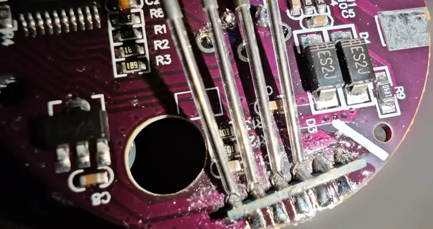

## Board Overview




[Tuya DY-RQ400A Combustible Gas Alarm](https://expo.tuya.com/product/602455) is a device that contains the [WB2S](https://docs.libretiny.eu/boards/wb2s/) (BK7231T) chip along with a [RJM8L151F6P6](https://www.runjetic.com/product/774.html) MCU (a [datasheet](https://cdn.myxypt.com/4412af49/22/06/ae01795334fbb272e3dcdc0f6464371691535dc2.pdf) is only available in Chinese). The device has Wi-Fi and Zigbee variants (this page is for the Wi-Fi model).



## System Interactions

The MCU communicates with the WB2S chip over UART1 which is also the UART used for flashing the chip. The protocol interactions follow [the Tuya serial protocol](https://developer.tuya.com/en/docs/iot/tuya-cloud-universal-serial-port-access-protocol?id=K9hhi0xxtn9cb) and so the Tuya components implemented in ESPHome are applicable here.

The gas level tracking and alarm logic is built into the MCU which exchanges the data points with the WB2S module, some parameters can be changed by the Wi-Fi module, some are merely used for status updates. There are also hardware buttons for:

1. Triggering a self-test which sets the alarm off as if the gas level is above a built-in threshold;
2. Triggering a Wi-Fi module reset (the reset button is connected to the MCU which [can trigger the Wi-Fi module reset](https://developer.tuya.com/en/docs/iot/tuya-cloud-universal-serial-port-access-protocol?id=K9hhi0xxtn9cb#title-10-Reset%20Wi-Fi%20connection)).

There is no way to adjust the gas threshold which is documented in the printed manual to be at 7±3 LEL ([Lower Explosive Limit](https://en.wikipedia.org/wiki/Flammability_limit)). Upon reaching that limit the alarm will go off producing an audible sound (which can be altered to 5 different melodies).

When powered on the device first goes through the pre-heat phase where the internal LED is flashing with different colors until it switches to continuous green light if all goes well. The gas sensor heats up noticeably in that process which is normal and expected.



## Data Points

There are a number of [Tuya data points](https://developer.tuya.com/en/docs/iot/tuya-cloud-universal-serial-port-access-protocol?id=K9hhi0xxtn9cb#title-3-Data%20units) exchanged between the Wi-Fi module and the MCU.

During the [module initialization](https://developer.tuya.com/en/docs/iot/mcu-protocol?id=K9hrdpyujeotg#title-6-Module%20initialization) process those data points are exposed by the MCU:

```log
  [21:50:55][C][tuya:041]: Tuya:
  [21:50:55][C][tuya:062]:   Datapoint 2: enum (value: 1)
  [21:50:55][C][tuya:058]:   Datapoint 5: int value (value: 0)
  [21:50:55][C][tuya:062]:   Datapoint 8: enum (value: 0)
  [21:50:55][C][tuya:058]:   Datapoint 3: int value (value: 10)
  [21:50:55][C][tuya:056]:   Datapoint 9: switch (value: OFF)
  [21:50:55][C][tuya:062]:   Datapoint 1: enum (value: 3)
  [21:50:55][C][tuya:056]:   Datapoint 10: switch (value: OFF)
  [21:50:55][C][tuya:056]:   Datapoint 12: switch (value: ON)
  [21:50:55][C][tuya:056]:   Datapoint 14: switch (value: OFF)
  [21:50:55][C][tuya:076]:   Product: '{"p":"13nrj1aeeaqh54cz","v":"1.0.0","m":0}'
```

The meaning of the data points respective to their logged numbers based on some experimentation and deduction is as follows:

1. Self-test Result (indicates 4 different outcomes of self-checking);
2. Gas Alarm Status (1 - normal state, 0 alarm);
3. Alarm Period (how much time will alarm keep going when the gas level is above threshold, 0 - 180 seconds);
4. Missing (unused DP number);
5. Gas Threshold Level (value of 100 is when the alarm goes off and is active until it is lower than 50);
6. Missing (unused DP number);
7. Missing (unused DP number);
8. Alarm Melody (5 different options to choose from);
9. Alarm Self-test (trigger a self-test manually, can be done via a hardware button too);
10. Sensor Preheat (despite being a switch, this is a read-only value indicating whether a pre-heat process is active or not. The MCU switches it to off when the process is finished and the green LED is continuously powered on).
11. Missing (unused DP number);
12. Alarm Sound (whether the audible sound should be produced by the alarm);
13. Missing (unused DP number);
14. Silence the Alarm (used to switch the ongoing alarm off once, the MCU switches this DP back to off automatically).

## Disassembly

The process is quite straightforward:

1) Use the physical button to detach the country-specific adapter;
2) Unscrew the screws on the bottom of the device;
3) Remove the perforated cover on the top of the device (use a needle to grab it if needed);
4) Unscrew the screws holding the board to the plastic part.

## Flashing

Flashing can be done via the [RX1 and TX1 pins](https://docs.libretiny.eu/boards/wb2s/#pinout) on the board.

Soldering is not necessary so long as you have hooks that can be attached to the board.



It is possible to grab all necessary pins with one hook type at once but the connection is very easy to break because of the way the pins are soldered.




The best approach when trying to use hooks is to test the connection with an ohmmeter.

3.3V with low current from an external UART is enough for the flashing process itself, however, for proper MCU and sensor operation more current is required and you would need to plug the device into a socket to make it come up successfully.

`ltchiptool` with `upk2esphome` can be used to generate an initial YAML from the original firmware using `ltchiptool plugin upk2esphome firmware <firmware-path>`, however, it cannot generate Tuya-specific sensors and other components based on the flash contents alone (it will only configure an empty `tuya` component).

## Board Configuration

The configuration below includes components for all Tuya data points exposed by the MCU and gives a functionally equivalent experience to the stock Tuya app but with ESPHome and Home Assistant and can be flashed using `esphome run --device /dev/<your-serial-device-name> <path-to-yaml>` (make sure to toggle the 3.3V pin while this command is started so that the flashing process starts).

```yaml
esphome:
  # DY-RQ400A https://expo.tuya.com/product/602455
  name: tuya-gas-alarm-wb2s

bk72xx:
  # https://docs.libretiny.eu/boards/wb2s/
  board: wb2s

logger:

web_server:

captive_portal:

mdns:

api:
  password: ""

ota:
  password: ""

wifi:
  ssid: !secret wifi_ssid
  password: !secret wifi_password
  ap:
      ssid: "tuya gas alarm"
uart:
  rx_pin: RX1
  tx_pin: TX1
  baud_rate: 9600

# The device contains an RJM8L151F6P6 MCU with which the Tuya WB2S
# module interacts over UART1. The MCU handles the alarm-related
# logic leaving some control capabilities to the Wi-Fi chip.
# https://www.runjetic.com/product/774.html
# Datasheet (Chinese): https://cdn.myxypt.com/4412af49/22/06/ae01795334fbb272e3dcdc0f6464371691535dc2.pdf
tuya:

text_sensor:
  - platform: libretiny
    version:
      name: LibreTiny Version
  - platform: "tuya"
    name: "Self-test Result"
    sensor_datapoint: 1
    filters:
      # The Tuya DP is an enum which is converted to human-readable strings.
      - map:
        - 0 -> Checking
        - 1 -> Success
        - 2 -> Failure
        - 3 -> Other

sensor:
  - platform: "tuya"
    name: "Gas Threshold Level"
    sensor_datapoint: 5
    # 7% LEL +- 3% (CH4) is the threshold for detection level per
    # the printed manual that comes with the device.
    # The DP value of 100 = 7% LEL (Lower Explosive Limit) - after
    # reaching that the MCU will trigger the alarm.
    unit_of_measurement: "%"
    state_class: "measurement"

binary_sensor:
  - platform: "tuya"
    name: "Gas Alarm"
    sensor_datapoint: 2
    # Whether a gas alarm is raised or not. Inverted since the value
    # of "1" means "normal state". The DP is an enum with only 2 values.
    filters:
      - invert:
  - platform: "tuya"
    # Indicates whether the gas sensor preheat is in progress or not.
    # It is done automatically when the device is powered on and the
    # led flashes with different colors during that process. The DP is
    # a switch but it cannot be controlled (read-only).
    name: "Sensor Preheat"
    sensor_datapoint: 10
switch:
  - platform: "tuya"
    # Trigger a self-test as if a gas level was over the threshold can
    # be controlled by the physical button (highlighted by the LED) on
    # the device as well.
    name: "Alarm Self-test"
    switch_datapoint: 9
    # The current value is fetched from the MCU upon initialization.
    restore_mode: DISABLED
  - platform: "tuya"
    # Enable or disable the buzzer when an alarm gets triggered.
    name: "Alarm Sound"
    switch_datapoint: 12
    # The current value is fetched from the MCU upon initialization.
    restore_mode: DISABLED
  - platform: "tuya"
    # Silence the alarm once if it is active.
    name: "Silence the Alarm"
    switch_datapoint: 14
    # The current value is fetched from the MCU upon initialization.
    restore_mode: DISABLED

number:
  - platform: "tuya"
    name: "Alarm Period"
    number_datapoint: 3
    # How much time will the alarm continue to be active
    # after detecting a gas level above the threshold.
    min_value: 0
    max_value: 180
    step: 1

select:
  - platform: "tuya"
    name: "Alarm Melody"
    enum_datapoint: 8
    optimistic: true
    options:
      0: Melody 1
      1: Melody 2
      2: Melody 3
      3: Melody 4
      4: Melody 5
```
